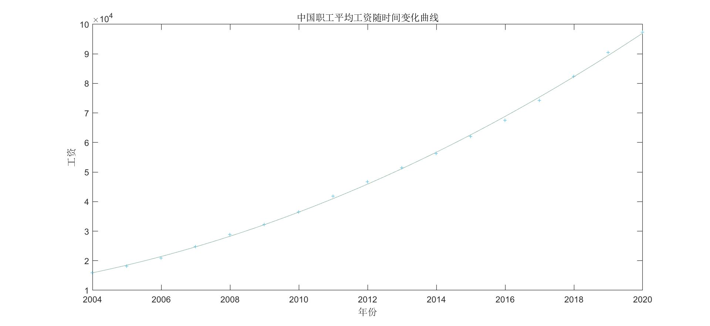
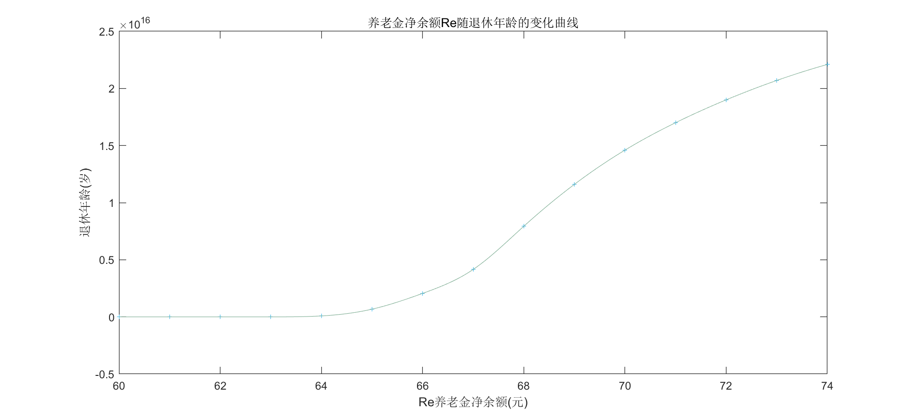

**1.选题新颖 （10分+）** 
**2.论文格式：题目、摘要、关键词、正文、参考文献（包含引文标注）（10分）** 
**3.写作规范，表达清楚（10分）** 
**4.假设合理（需要参考文献的部分），模型的检验，对参数的灵敏度分析（10分）** 
**5.模型建立和求解 （40分）**
**6.模型结果的呈现 （20分）**
**7.模型中体现的创造性想法(10分+)** 

# 中国人口发展趋势与养老金政策的分析

## ——期末论文

宋永欣(19231061) 

谭墨林(19231150)

## 摘要

科学合理预测未来人口走势，事关国计民生，对国家与个人都有重大意义。本文基于最新出炉的第七次人口普查数据及各种普查与抽样调查数据，针对我国人口发展问题，采用双性别的人口发展模型（推广的Leslie模型），借助灰色预测、ARIMA时间序列分析、贝叶斯分层模型等方法进行参数估计，对中国未来人口发展趋势进行分析并得到以下结论：（1）（2）（3）

同时，在预测中国未来人口发展趋势的基础上，我们研究了中国老龄化趋势对于中国养老保险制度的影响，本文采用养老金精算模型，结合Leslie模型预测结果定量计算得到中国现行制度下最合适的男性女性退休年龄应为64岁。同时，本文通过计算指出当前的养老金制度无法有效应对中国严峻的老龄化趋势，养老金制度亟待完善。

尽管分析结果让我们这一代也或许是唯一一代独生子女的笑容僵在脸上，但是这也只能算是时代的烙印，我们能做的只有砥砺前行罢了。

## 关键词：

$Leslie$模型， 人口预测，独生子女焦虑

## 1.研究背景

自建国以来，我国生育政策经过了四个阶段的演变^[1]^：

1. 1949-1953年鼓励生育阶段：进行限制节育与人工流产
2. 1954-1977年宽松计划生育阶段：从节制生育到“晚稀少”政策
3. 1978-2013年严格计划生育阶段：独生子女政策、“一孩半”政策、“双独二孩”政策
4. 2014-至今放松计划生育阶段：从“单独二孩”到“全面二孩”再到“全面三孩”

每个历史阶段的决定都有其合理性，计划生育的实施让我国有足够的剩余资本来发展生产力，但目前来看我国人口危机邻近。近年来出生人口大幅减少，生育意愿降低，而建国初期鼓励生育阶段和后来的宽松计划生育时期的出生的人口，正逐步迈向老年，人口老龄化加速到来。由此带来的劳动力短缺很有可能导致经济增长无力，引发国内社会普遍担忧。第七次全国人口普查公报的公布显示总和生育率已经来到了1.3，处于历史较低水平；老年人口超过2.64亿，规模居世界第一，老龄化程度超过13.5%。这次普查结果验证并加深了国内社会对于我国人口问题的忧虑。

与此同时，我国的人口转型相比于发达国家的人口转型有较大的不同^[2]^：

1. 人口转型更快、人口红利期更短：发达国家人口转型持续百年以上，中国从建国初逐渐开始转型，预计到 2035 年左右进入第Ⅳ阶段，前后也就八十年。以总抚养比小于 50%作为人口红利的判定界限，我国 1995 年降至 50%以下，2019 年为 41.5%，预计 2030 年超过 50%，总共算起来，我国的人口红利期只有 35 年，较日韩等发达国家相比更短。
2. 老龄化更严重、未富先老：联合国数据显示，1990-2019年，世界老年人口年平均增速为 2.7%，发达国家为 2.1%，而我国为 3.2%，预计未来二十年都将快于世界平均增速。而且发达国家老龄化通常发生在高收入阶段，其进入老龄化社会时人均 GDP 多在二千美元以上，进入深度老龄化社会时多在三万美元以上， 但我国该数字分别为约一千和一万美元^[3]^。
3. 少子化更严重：1950-2019 年，我国迅速从高生育率国家转变为低生育率国家（其中上世纪九十年代以来总和生育率低于更替水平并持续走低），总和生育率从 6.71 下降至 1.70，减少 5.01，同期美、日、英、法则分别减少 1.28、2.08、0.33 和 1.00。

对于我们这一代计划生育造成的独生子女的父辈而言，养老问题已经迫在眉睫。对他们来说，既要抚养他们的上一辈，又要抚养下一辈，同时不太可能指望下一辈抚养他们。人口红利在当时是个好东西，事后是需要偿还的负债，对我们的父辈而言，赶上了人口红利带来的快速发展期，但当他们进入老年时，社会的倒金字塔型人口使得年轻人缴纳的社保不足以支持支付老年人的社保支出，国家的养老体系难以为继。所以，急需结构性的养老制度改革来为保障国家养老体系的平衡，避免导致依靠大量国家财政收入来维持养老金的发放。

本文聚焦于中国人口发展和养老金制度改革，在最新数据的基础上，预测未来中国人口总量和年龄结构，进而对养老金制度的改革提出政策上的建议。

## 2.问题分析

### 2.1问题重述

结合几次人口普查和抽样调查数据，刻画当前人口结构变化的规律，建立数学模型并对未来中国人口总量和年龄结构进行预测，人口预测的目标是尽可能与实际相吻合。并在预测的基础上，对中国养老金制度的改革提供政策指导，目标是让国家养老体系收入能基本覆盖未来支出，避免未来依靠大量国家财政收入来维持养老金的发放。

### 2.2文献综述

陈艳玫等人^[4]^运用时间序列分析方法，构建ARIMA预测模型，预测了2015-2050年每五年年龄别、性别存活率预测值。

贺嘉钰等人^[5]^对总人口性别比、年龄别人口性别比建立了灰色预测模型，探索未来10年内各年龄层男女性别比例的发展趋势。

赵子铭^[6]^以我国 1949—2017 年人口总数为研究对象，利用时间序列方法及不同检验、最优化方法建立 ARIMA 模型， 并用于预测 2019 年我国人口总数. 通过 AIC 系数比较、 白噪声检验， 可以认为 ARIMA （1,2,1）模型拟合效果较好。从第七次人口普查的结果来看，其预测精度很高。

曹建^[7]^在全面放开二胎政策下，建立$Leslie$模型对中国人口进行预测和分析。

### 2.3问题求解

借助离散化的宋健模型（推广的$Leslie$模型），结合第七次人口普查数据以及历年人口抽样调查数据，建立模型并且对参数做出恰当估计，对2021年之后的人口发展趋势做预测。由于$Leslie$模型考虑人口年龄结构，且我们建立的是双性别模型，故关键的影响因素有人口总数，分年龄别性别比例，分年龄别人口比例，分年龄别、分性别死亡率，分年龄别生育率，出生性别比例。

同时，查阅中国现有养老金制度，合理结合养老金精算模型对养老金基金的盈亏做预测。结合现有国情，讨论老龄化趋势对现有养老金制度的冲击。用全面开放二孩政策后人口增长的数据辅以验证并预测三孩、四孩乃至全面放开生育后对中国人口结构的影响。（这里你改改吧）

## 3.假设与符号说明及创新之处

### 基本假设

1. 男、女在不同年龄段的死亡率不随时间变化而变化
2. 育龄妇女年龄介于15到49岁之间
3. 不考虑外籍人口入籍中国，同样不考虑中国人口迁移国外
4. 假设相当长一段时间内国家生育政策不会发生变动
5. 环境稳定，中国居民死亡率在一定时间内保持不变，无意外灾害造成居民大量死亡。
6. 模型求解中使用到的国家抽样调查数据能代表全国的情况

### 符号说明

| 符号                    | 含义                                          |
| ----------------------- | --------------------------------------------- |
| $f_i(t)$                | 第 $t$ 年 $i$ 组的女性人数                    |
| $m_i(t)$                | 第 $t$ 年 $i$ 组的男性人数                    |
| $born_i$                | 第 $i$ 组女性的生育率                         |
| $r_m$                   | 新生婴儿的男性比例                            |
| $r_f$                   | 新生婴儿的女性比例                            |
| $df_i(t)$               | 第 $t$ 年第 $i$ 组的女性死亡率                |
| $dm_i(t)$               | 第 $t$ 年第 $i$ 组的男性死亡率                |
| $f(t)$                  | 第t年出生的人口数量                           |
| $F(t)$                  | 第 $t$ 年女性人数矩阵                         |
| $M(t)$                  | 第 $t$ 年男性人数矩阵                         |
| $A_f$                   | 女性存活矩阵                                  |
| $A_m$                   | 男性存活矩阵                                  |
| $start$                 | 劳动者起始就业年龄                            |
| $retire$                | 劳动者退休年龄                                |
| $death$                 | 劳动者的死亡年龄                              |
| $e$                     | 总缴费率                                      |
| $r$                     | 养老金的替代率                                |
| $In(year)$              | $year$年的养老基金的收入                      |
| $nIn(year)$             | $year$年的养老保险缴费人员数量                |
| $nOut(year)$            | $year$年的领取养老保险人员数量                |
| $nIn_{age}(year)$       | $year$年份年龄为$age$的领取养老保险人员的数量 |
| $nOut_{age}(year)$      | $year$年的领取养老保险人员数量                |
| $pro$                   | 参与养老保险制度的人的比例                    |
| $\overline{wage(year)}$ | $year$年份中国工人的平均工资                  |
| $$Per(t)$$              | 个人基础养老金收入部分                        |
| $ Exp(t)$               | 个人指数化年平均缴费工资                      |
| $e$                     | 总缴费率                                      |
| $inup$                  | 养老金投资回报率, $0\le inup\le1$             |
| $Re$                    | $[a,a+n-1]$ 共n年的养老金净余额               |
| $up$                    | 养老金的上浮参数，$0\le up\le1$               |

## 4.模型建立

### 4.1人口预测

人口总量和人口年龄结构是重要的人口特征，当前我国与国际社会关注的人口问题重点在于未来我国人口总量的达峰和负增长，以及人口老龄化的加深。

在研究人口问题时，按年龄分布的人口结构情况是非常重要的。两个国家或地区，目前人口的总数一样，如果其中之一的年轻人比例高于另一个，那么二者的人口发展状况将很不一样。下面将考虑人口年龄，不同年龄的生育率及死亡率等因素来建立人口离散模型，用以预测及控制人口增长及人口老化问题。本方法为离散化的宋建模型，实际上是推广的Leslie模型。

则有第 $t$ 年出生的人口数量为对生育率 $b_i(t)$ 做分解

本文对男性和女性分别计算，$A_F$ ，$A_M$分别代表女性和男性的状态转移矩阵矩阵，用于左乘人数列向量矩阵。其中女性按年龄分组的列向量 $F(t)$ ,男性按年龄分组的列向量 $M(t)$ 如下所示：
$$
F(t) = (f1(t),f2(t),f3(t),f4(t),\cdots,f20(t))'
$$

$$
M(t) = (m1(t),m2(t),m3(t),m4(t),\cdots,m20(t))'
$$

注意其中的$\ f_i(t),\  m_i(t)\ $分别表示年份为 $t$ 时候女性第 $i$ 年龄组的人数，年份为 $t$ 时候男性第 $i$ 年龄组的人数。

$A_F$，$A_M$分别是女性和男性的存活率矩阵，$A_F$，$A_M$ 形式如下：
$$
A_f=\begin{bmatrix} 0&0&0&0 &\cdots &0 \\1-df_1 & 0 & 0 & 0 &\cdots&0 \\0 & 1-df_2 & 0&0 &\cdots &0\\0& 0& 1-df_3 &0 & \cdots&0 
\\ 0 & 0 & 0 & 1-df_4 & \cdots &0
\\ \vdots & \vdots & \vdots & \vdots & \ddots & \vdots
\\ 0 & 0 & 0 &0 & \cdots &0\end{bmatrix}
$$

$$
A_m=\begin{bmatrix} 0 & 0 &0&0&\cdots&0\\1-dm_1 & 0 & 0 & 0 &\cdots&0 \\0 & 1-dm_2 & 0&0 &\cdots &0\\0& 0& 1-dm_3 &0 & \cdots&0 
\\ 0 & 0 & 0 & 1-dm_4 & \cdots &0
\\ \vdots & \vdots & \vdots & \vdots & \ddots & \vdots
\\ 0 & 0 & 0 &0 & \cdots &0\end{bmatrix}
$$

$1-df_i\ ,\ 1-dm_j$ 分别代表第i组女性的存活率,第j组男性的存活率

$B$是女性的生育率矩阵，形式如下：
$$
B=
\begin{bmatrix} 
0&0&0&born_1 &\cdots &born_7&0 \\
0&0&0&0 &\cdots &0&0 \\
0&0&0&0 &\cdots &0&0 \\
0&0&0&0 &\cdots &0&0 \\
0&0&0&0 &\cdots &0&0 \\
\vdots&\vdots&\vdots&\vdots&\ddots&\vdots &\vdots\\
0&0&0&0 &\cdots &0 &0
\end{bmatrix}
$$

因此，男性和女性的分年龄段人口数量向量有以下关系：
$$
M(t+5) = A_m\cdot M(t) + B\cdot F(t)\cdot r_m\\
F(t+5) = A_f\cdot F(t) + B\cdot F(t)\cdot r_f
$$
#### 参数估计

#### 结果分析

注：图中红色为女性，蓝色为男性。

### 4.2人口数目对养老金的影响

#### 4.3.1中国养老金制度现状

养老金制度，顾名思义，就是要让年长公民能够在劳动能力下降，能够维持正常生活水平而产生的社会福利退休制度。

中国养老金的建设已经有十多年的历史，在探索实践中，养老保险的改革成为中国公民关注的焦点。在多次的养老保险制度的改革中，我国逐渐建立了更加完善的养老保险制度，创立了更加规范的统账结合新制度，养老保险的覆盖面逐年扩大。

中华人民共和国《劳动合同法规定》，年满六十周岁男性，年满五十周岁女性可以退休。从事重体力劳动的55岁男性和45岁女性可以退休。因病丧失劳动能力的人可以提前退休。

基本养老制度在探索中也在不断完善，不同时期参加工作的人有不同的养老金分配制度。1996年1月1日以后参加工作，缴费年限累计满15年及以上，2006年1月1日退休之后的养老金由基础养老金和个人账户养老金两个部分组成。1995年12月31日以前参加工作，2006年I月1日以后退休，缴费年限(含视同缴费年限)累计满15年及以上的人员，其基本养老金由基础养老金、个人账户养老金、过渡性养老金等组成。2005年12月31日以前己经退休、退职的人员，仍按原待遇标准计发基本养老金。

但是，现行制度并不能有效应对人口老龄化危机。新中国成立之后，人口结构发生巨大变化。1964年第二次人口普查后逐渐提升，65岁以上老年人口比例在1982年的第三次人口普查时达到了4.91%；1990年的第四次人口普查时达到了5.57%；2000年的第五次人口普查时达到了6.96%，2010年第六次人口普查时达到了8.87%，而在2020年第七次人口普查中，老龄人口比例达到了13.50%，我国已经进入了中等老龄化社会。因此，养老保险制度的完善是必要的。如何让中国的老年人老有所养，老有所依是养老保险制度改革的重要指标。

当今，中国公民的预期寿命不断增加，60岁老年人大都健康状况良好，工作热情高。并且，女性的平均寿命远高于男性的平均寿命，中国女性相较于中国男性过早的退休时间导致了女性在职场的竞争力进一步下降，有学者认为，缩短女性的退休退休年龄其实导致了女性职位上升遭遇瓶颈，工作收入无法得到提升，养老金因缴费年限少而低于男性，这样的保护其实是一种歧视，过早的女性退休年龄是中国男女同工同酬的巨大绊脚石。

#### 4.3.2 养老保险模型建立

根据上面的中国养老金制度的简介，可以看到中国目前的养老金改革注定不会停滞，复杂多变的人口结构和中国蓬勃发展的社会主义市场经济催动养老金制度不断完善。

下面我们根据已经建立好的人口模型结果来分析预测中国养老金的收支平衡问题与中国劳动者的最优退休年龄问题。在这里，我们化繁为简，将目前中国复杂的养老金分配制度简化，建立人口以退休年龄关系的“养老金模型”

为了简化养老金问题模型，我们将中华人民共和国现有的复杂养老金分配制度做以下简化。

> 今年净余额$Res(t)$=前一年的基金净余额*养老金投资回报率+本年收入-本年支出

$In(t)$表示 $t$ 年份的养老金基金总收入
$$
In(t)=e\cdot\overline{wage(t)}\cdot nIn(t)\cdot pro
$$

$Out(t)$表示 t 年份养老金基金的总支出

计算退休个人养老金收入，只考虑基础养老金部分

有数学关系
$$
基础养老金部分 = \frac{去年年平均工资\overline{wage(t-1)}+个人指数化月平均缴费工资}{2} \cdot缴费年限 \cdot 1\%
$$

$$
Per(t) =\frac{\overline{wage(t-1)}+Exp(t)}{2} \cdot(retire - start) \cdot 1\%\\
Exp(t)\approx\overline{wage(t-1)}
$$

其中
$$
(retire -start)\cdot 1\% \approx r(t) \cdot (1+up)^{age-retire+1}
$$
推导得出
$$
Per_{age}(t) =\overline{wage(t-1)} \cdot r(t)\cdot (1+up)^{age-retire+1}
$$

$$
Out(t) = \sum_{age=retire}^{death-1}Per_{age}(t)\cdot nOut_{age}(t)
$$

即
$$
Out(t)=\sum_{age=retire}^{death-1}\overline{wage(t-1)} \cdot r(t)\cdot (1+up)^{age-retire+1}\cdot nOut_{age}(t)
$$
$Re$ 代表 $[a,a+n-1]$ 共n年的养老金净余额
$$
Re=(In(a)-Out(a))\cdot(1+inup)^{n-1}+(In(a+1)-Out(a+1))\cdot(1+inup)^{n-2} + \cdots+(In(a+n-1)-Out(a+n-1))
$$

$$
Re = \sum_{t=a}^{a+n-1} (In(t)-Out(t))\cdot (1+inup)^{a+n-1-t}
$$

#### 4.3.3参数设定

$e$ 是中国养老金的总体缴费率，根据目前状况，$e=28\%$ 

$up$ 是中国养老金的上浮参数，$0\le up\le1$ ，将$up$的参数估计值设置为25%

$start$ 为中国职工的入职年龄，设置成25。

养老金替代率 $r(t)$ ，由于受到工龄，工种，退休时间的多重因素影响，养老金替代率不同人不同时间均不同。这里采用45%代表全体退休人员的养老金替代率

$death$估计采用第七次人口普查的男女综合平均寿命，74.83≈75岁

参与养老保险的人数比例，根据经验数值设置为50%

$inup$ 养老金投资回报率,根据现有金融市场的投资回报率，设置为5%

#### 4.3.4模型计算

此养老保险模型假设预测的区间是30年，即2020到2050

不同年份中国劳动者平均工资表格

| 年份                           | 2020     | 2019        | 2018     | 2017     | 2016     | 2015     | 2014    | 2013     | 2012     | 2011     | 2010     | 2009     | 2008     | 2007     | 2006     | 2005     | 2004  |
| ------------------------------ | -------- | ----------- | -------- | -------- | -------- | -------- | ------- | -------- | -------- | -------- | -------- | -------- | -------- | -------- | -------- | -------- | ----- |
| 城镇单位就业人员平均工资(元)   | 97379    | 90501       | 82413    | 74318    | 67569    | 62029    | 56360   | 51483    | 46769    | 41799    | 36539    | 32244    | 28898    | 24721    | 20856    | 18200    | 15920 |
| 城镇单位就业人员平均工资增长率 | 0.075999 | 0.098139857 | 0.108924 | 0.099883 | 0.089313 | 0.100586 | 0.09473 | 0.100793 | 0.118902 | 0.143956 | 0.133203 | 0.115787 | 0.168966 | 0.185318 | 0.145934 | 0.143216 |       |

根据上面表格数据，绘制2010年到2020年职工工资增长率随时间变化的折线图得到

根据图线，发现近10年工资增长速度放缓，近10年工资增长速度与年份不具有明显的函数关系。

绘制中国劳动者平均工资与时间序列的散点图，发现中国劳动者平均工资与时间序列呈现一定的函数关系。

采用Matlab进行最小二乘法拟合，在采用二次函数拟合时效果最好， $R^2=0.9994$ 。因此采用二次曲线对中国职工的平均工资拟合，得到2020到2030年中国职工的平均工资 $\overline{wage(year)}$ 的预测模型为：
$$
\overline{wage(x)} = p1*\overline{x}^2 + p2*\overline{x} + p3\\
\overline{x}=\frac{x-2012}{5.05}
$$
其中  $x$ 代表年份，  $\overline{x}$ 是 $x$ 标准化的结果

通过 $matlab$  $fittype( 'poly2' )$ 函数计算得到拟合结果
$$
f(x) = 4197*\overline{x}^2 + 25600*\overline{x} + 45930\\
\overline{x}=\frac{x-2012}{5.05}
$$
因此 $2021$ 到 $2030$ 年中国职工平均工资 $\overline{wage(x)}$ 的预测值为：

| 年份                         | 2021        | 2022     | 2023     | 2024     | 2025     | 2026     | 2027     | 2028     | 2029     |
| ---------------------------- | ----------- | -------- | -------- | -------- | -------- | -------- | -------- | -------- | -------- |
| 城镇单位就业人员平均工资(元) | 104884.1025 | 113080.3 | 121605.6 | 130460.1 | 139643.7 | 149156.4 | 158998.3 | 169169.4 | 179669.6 |

| 2030     | 2031     | 2032   | 2033     | 2034     | 2035     | 2036     | 2037     | 2038     | 2039     |
| -------- | -------- | ------ | -------- | -------- | -------- | -------- | -------- | -------- | -------- |
| 190498.9 | 201657.4 | 213145 | 224961.7 | 237107.6 | 249582.7 | 262386.9 | 275520.2 | 288982.7 | 302774.3 |

| 2040     | 2041   | 2042     | 2043     | 2044     | 2045     | 2046     | 2047     | 2048     | 2049     | 2050     |
| -------- | ------ | -------- | -------- | -------- | -------- | -------- | -------- | -------- | -------- | -------- |
| 316895.1 | 331345 | 346124.1 | 361232.3 | 376669.7 | 392436.1 | 408531.8 | 424956.6 | 441710.5 | 458793.6 | 476205.8 |

结合工资预测值，计算得到

$$
Re = \sum_{t=a}^{a+n-1} (In(t)-Out(t))\cdot (1+inup)^{a+n-1-t}
$$

通过Python编程计算得出$Re$，即 $[a,a+n-1]$ 共n年的养老金净余额结果

| 退休年龄(年)         | 60   | 61   | 62   | 63   | 64       | 65       | 66       | 67       | 68       | 69       | 70       | 71       | 72       | 73       | 74       |
| -------------------- | ---- | ---- | ---- | ---- | -------- | -------- | -------- | -------- | -------- | -------- | -------- | -------- | -------- | -------- | -------- |
| 30年养老金净余额(元) | 0    | 0    | 0    | 0    | 8.19E+13 | 6.74E+14 | 2.05E+15 | 4.15E+15 | 7.93E+15 | 1.16E+16 | 1.46E+16 | 1.70E+16 | 1.90E+16 | 2.07E+16 | 2.21E+16 |

绘制养老金净余额Re随退休年龄的变化曲线

#### 4.3.5结论

根据上文模型计算得到的结果，男女退休年龄为64岁的时候有养老金净余额为正数，国家养老体系可以持续运行，政府无需为养老基金实施政策补贴。

即退休年龄设置成为64岁时可以有效应对人口重度老龄化给国家养老体系带来的冲击。

但是，仅凭借数学计算结果无法成为养老金政策改革的依据。在养老金改革时，应首先考虑国民心理因素，防止过于激进的改革政策让民众产生不满情绪，防止社会产生动荡。

## 5.模型结果与分析

## 6.灵敏度分析

~~在φ=π附近，灵敏度S(t,φ)=0.25/44.44*100=0.56，对φ的微小扰动不敏感。~~

~~通过上述分析，我们的模型是十分稳健可靠的，尽管与现实仍有差距，也是很喜人的结果。~~

#### 6.1人口模型灵敏度分析

 #### 6.2养老保险模型灵敏度分析

在 $up=0.25$ 附近，令 $\delta up = -0.06$ , 有 $ \delta retire = -1$ , 因此  
$$
S(retire,up) = \frac{\delta{retire}\cdot up}{\delta{up}\cdot retire} = \frac{-1\times0.25}{-0.06\times64}\times100\%=6.51\%
$$

在 $inup=0.05$ 附近，令 $\delta inup = -0.16$ , 有 $ \delta retire = 1$ , 因此  
$$
S(retire,inup) = \frac{\delta{retire}\cdot inup}{\delta{inup}\cdot retire} = \frac{-1\times0.05}{-0.16\times64}\times100\%=0.49\%
$$
在 $r=0.45$ 附近，令 $\delta r = 0.16$ , 有 $ \delta retire = 1$ , 因此  
$$
S(retire,r) = \frac{\delta{retire}\cdot r}{\delta{r}\cdot retire} = \frac{1\times0.45}{0.16\times64}\times100\%=4.39\%
$$

通过以上的灵敏度分析，可以得出养老保险精算模型对 $inup$ 养老金投资回报率的微笑扰动不敏感。

养老金的上浮参数 $up$ 和养老金替代率 $r$ 的变化对最佳退休年龄 $retire$ 的影响很大

## 7.数据网址和文献列表

[1]中国生育报告2020 恒大研究院 任泽平 熊柴 周哲

[2]关于我国人口转型的认识和应对之策 中国人民银行工作论文 陈浩 徐瑞慧 唐滔 高宏

[3]数据来源：联合国、世界银行、CEIC、国家统计局、麦迪森世界经济千年史数据库。

[4]２０１５—２０５０年中国人口老龄化趋势与老年人口 预测 陈艳玫１， 刘子锋２， 李贤德１， 黄奕祥１，３

[5]灰色预测在中国人口性别比中的应用 贺嘉钰　胡锐玲　王明春  湖南农业大学信息与智能科学技术学院信科系

[6]基于 ARIMA 模型的中国人口预测 赵子铭

[7]全面放开二孩政策下中国人口预测与分析 ——基于Leslie改进模型 曹  建

[8]

[9]